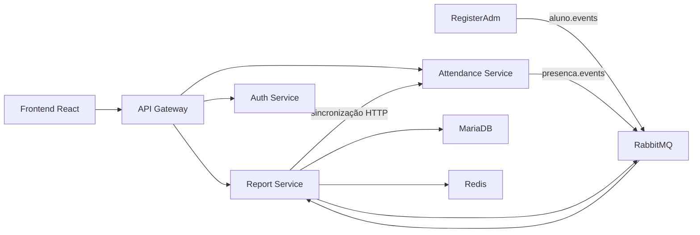
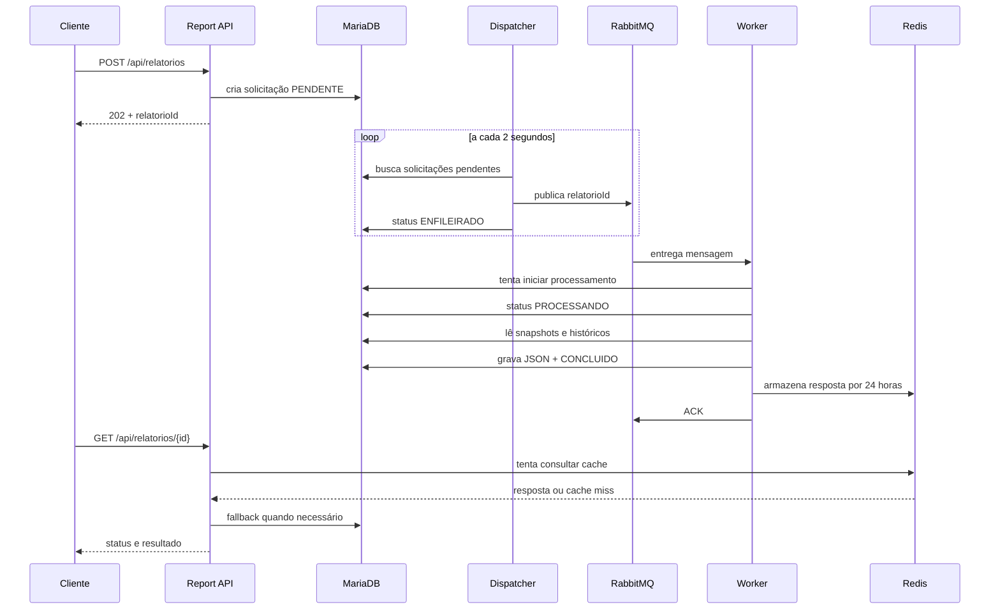

# Serviço de Relatórios do Transporte Escolar

Microsserviço responsável por consolidar dados de alunos, presenças e rotas,
calcular indicadores e gerar relatórios assíncronos em JSON, PDF e CSV.

O serviço foi desenvolvido em **.NET 9** e usa:

- **RabbitMQ** para mensageria e processamento assíncrono;
- **MariaDB 11.2** como fonte permanente de dados;
- **Redis** como cache opcional;
- **Entity Framework Core** para persistência e migrations;
- **QuestPDF** para geração de PDF;
- **CsvHelper** para geração de CSV;
- **BackgroundService** para consumidores, dispatcher e worker.

## Responsabilidades

O serviço:

- mantém uma cópia local dos alunos necessários aos relatórios;
- mantém o histórico de presenças recebidas;
- armazena dados históricos de rotas;
- calcula frequência individual e geral;
- calcula quilômetros por dia e média diária;
- calcula indicadores operacionais;
- recebe solicitações de relatório sem bloquear a requisição HTTP;
- processa relatórios em segundo plano;
- controla status, tentativas e erros de processamento;
- mantém os resultados JSON no MariaDB;
- disponibiliza PDF e CSV gerados sob demanda;
- aplica autorização e propriedade dos relatórios individuais;
- permite sincronização manual com o serviço de presenças.

## Arquitetura

O projeto segue separação em camadas:

```text
TransporteEscolar.Relatorios.Api
├── Controllers
├── Middlewares
└── inicialização e migrations

TransporteEscolar.Relatorios.Application
├── casos de uso
├── serviços de relatório
├── DTOs
├── abstrações
└── regras de autorização

TransporteEscolar.Relatorios.Domain
├── entidades
└── enums de domínio

TransporteEscolar.Relatorios.Infrastructure
├── MariaDB e repositórios
├── RabbitMQ
├── Redis
└── exportação PDF/CSV
```

Os controllers conhecem apenas os serviços da camada de aplicação. A aplicação
depende de interfaces, enquanto a infraestrutura fornece as implementações de
banco, cache, mensageria e arquivos.

## Visão distribuída do sistema



O API Gateway valida o JWT, remove possíveis cabeçalhos de identidade enviados
pelo cliente e adiciona cabeçalhos confiáveis:

- `X-User-Id`;
- `X-User-Role`;
- `X-Profile-Id`;
- `X-Correlation-Id`.

O Report usa `X-User-Role` e `X-Profile-Id` para aplicar a autorização também no
próprio serviço. Assim, a segurança não depende exclusivamente do Gateway.

## Processamento assíncrono dos relatórios

Uma solicitação HTTP não executa o cálculo completo do relatório. Ela apenas
registra o trabalho no MariaDB e retorna `202 Accepted`.



### Por que o MariaDB é gravado antes da fila?

O banco é a fonte de verdade. Se RabbitMQ estiver temporariamente indisponível,
a solicitação permanece como `PENDENTE` e poderá ser publicada posteriormente.
Isso evita perder um relatório entre a requisição HTTP e a publicação da
mensagem.

### Dispatcher

`RelatorioDispatcher` é um `BackgroundService` que:

- consulta até 50 solicitações por ciclo;
- executa a consulta a cada 2 segundos;
- publica somente o `relatorioId`;
- usa mensagens persistentes;
- marca a solicitação como `ENFILEIRADO`;
- tenta reconectar ao RabbitMQ após 5 segundos em caso de falha;
- reenfileira trabalhos parados há mais de 10 minutos.

### Worker

`RelatorioWorker` é outro `BackgroundService` que:

- consome a fila `relatorio.gerar`;
- usa confirmação manual de mensagem;
- usa `prefetchCount = 1`;
- cria um escopo de injeção de dependência por mensagem;
- altera o status para `PROCESSANDO`;
- gera o resultado correspondente ao tipo solicitado;
- persiste o JSON antes de confirmar a mensagem;
- envia `ACK` somente depois do processamento;
- usa `NACK` em caso de falha.

O `prefetchCount = 1` faz cada instância do worker receber apenas uma mensagem
não confirmada por vez. Se novas instâncias do Report forem adicionadas, o
RabbitMQ distribui os relatórios entre elas.

## Topologia RabbitMQ

### Geração de relatórios

| Recurso | Nome | Tipo/função |
|---|---|---|
| Exchange principal | `relatorio.events` | `direct` |
| Routing key | `relatorio.gerar` | identifica trabalhos de geração |
| Fila principal | `relatorio.gerar` | consumida pelo worker |
| Dead-letter exchange | `relatorio.dlx` | `direct` |
| Dead-letter queue | `relatorio.gerar.dlq` | mensagens inválidas ou esgotadas |

Exemplo de mensagem:

```json
{
  "relatorioId": "0f5221a5-f475-4e27-8c09-fd54450e949e"
}
```

A mensagem não carrega todos os dados do relatório. O worker consulta o
MariaDB pelo ID, reduzindo o tamanho da mensagem e mantendo o banco como
fonte oficial.

### Eventos de alunos

| Exchange | Routing key | Fila do Report |
|---|---|---|
| `aluno.events` | `aluno.cadastrado` | `relatorio.aluno.cadastrado` |
| `aluno.events` | `aluno.atualizado` | `relatorio.aluno.atualizado` |

Esses eventos criam ou atualizam `AlunoSnapshot`. O `ExternalId` recebido é o
mesmo identificador de perfil usado pelo Auth, Gateway e Attendance.

### Eventos de presença

| Exchange | Routing key | Fila do Report |
|---|---|---|
| `presenca.events` | `presenca.registrada` | `relatorio.presenca.registrada` |

O consumidor procura o aluno pelo `ExternalId` e registra a presença no
histórico. Existe uma restrição única por aluno e data para impedir registros
duplicados.

## Estados de uma solicitação

```text
PENDENTE
   ↓
ENFILEIRADO
   ↓
PROCESSANDO
   ├──→ CONCLUIDO
   └──→ ENFILEIRADO → nova tentativa
                    └──→ ERRO após 3 tentativas
```

| Estado | Significado |
|---|---|
| `PENDENTE` | solicitação persistida, aguardando publicação |
| `ENFILEIRADO` | ID publicado ou aguardando nova tentativa |
| `PROCESSANDO` | um worker obteve o direito de processar |
| `CONCLUIDO` | resultado JSON persistido |
| `ERRO` | três tentativas falharam |

## Idempotência, concorrência e tolerância a falhas

O RabbitMQ trabalha com entrega **at least once**: uma mensagem pode ser entregue
mais de uma vez. Por isso, o consumidor precisa ser idempotente.

Antes do cálculo, o repositório executa uma atualização condicional no
MariaDB. A solicitação só entra em processamento quando:

- ainda não está `CONCLUIDO`;
- não está sendo processada;
- possui menos de três tentativas.

Se duas mensagens iguais chegarem simultaneamente, somente uma consegue alterar
o estado para `PROCESSANDO`. A outra não recalcula o relatório.

Outras garantias:

- filas e exchanges são duráveis;
- mensagens de relatório são persistentes;
- o resultado é salvo antes do `ACK`;
- solicitações pendentes sobrevivem ao reinício da API;
- conexões RabbitMQ têm recuperação automática;
- os `BackgroundService` respeitam o cancelamento da aplicação;
- o Redis pode falhar sem impedir geração ou consulta;
- migrations são aplicadas na inicialização e falhas impedem uma inicialização
  inconsistente.

### Retentativas e DLQ

Cada tentativa incrementa `Tentativas`.

- nas duas primeiras falhas, a mensagem é reenfileirada;
- na terceira falha, a solicitação recebe `ERRO`;
- a mensagem recebe `NACK` sem requeue;
- RabbitMQ encaminha a mensagem para `relatorio.gerar.dlq`.

Mensagens com JSON inválido ou sem um `relatorioId` válido também seguem para a
DLQ.

## Persistência

### MariaDB

O MariaDB é a fonte permanente e armazena:

- `alunos_snapshot`;
- `presencas_historicas`;
- `rotas_historicas`;
- `solicitacoes_relatorio`;
- histórico das migrations do Entity Framework.

Uma solicitação contém:

- ID;
- tipo;
- ano e mês;
- status;
- papel do solicitante;
- `profileId` do solicitante, quando aplicável;
- resultado JSON;
- mensagem de erro;
- quantidade de tentativas;
- datas de criação, atualização, início e conclusão.

Há índices para status, data de criação e histórico por perfil. O resultado fica
em uma coluna `longtext`, mantendo o conteúdo serializado como JSON.

### Redis

O Redis é usado somente como cache de relatórios concluídos:

```text
relatorio:v2:{relatorioId}
```

O TTL é de 24 horas.

Fluxo de consulta:

1. tenta buscar no Redis;
2. em cache miss ou indisponibilidade, consulta MariaDB;
3. se o relatório estiver concluído, repopula o cache;
4. devolve a resposta ao cliente.

Redis não é fila e não é fonte permanente. Reiniciar ou limpar o Redis não
remove relatórios.

## Tipos de relatório

### `RESUMO_MENSAL`

Contém:

- total de confirmações;
- total de cancelamentos;
- total de rotas;
- média diária de quilômetros.

### `FREQUENCIA_ALUNOS`

Contém, para cada aluno:

- nome;
- ID externo;
- dias confirmados;
- dias cancelados;
- percentual de frequência.

### `PRESENCAS_DETALHADAS`

Contém:

- aluno;
- ID externo;
- data;
- situação;
- horário de confirmação;
- horário de cancelamento;
- endereço utilizado, quando disponível.

### `DESEMPENHO_ROTAS`

Contém:

- rotas por data;
- distância por rota;
- alunos transportados;
- distância total;
- média de quilômetros por rota;
- total de alunos transportados.

Atualmente, o serviço de rotas ainda não publica os eventos históricos
necessários para o Report. Portanto, esse relatório pode aparecer zerado.

### `FREQUENCIA_PROPRIA`

Relatório individual do aluno autenticado. O aluno é determinado exclusivamente
pelo cabeçalho confiável `X-Profile-Id`; o cliente não envia um ID de aluno no
corpo da solicitação.

## PDF e CSV

O resultado oficial é o JSON persistido. PDF e CSV são projeções desse resultado
e são gerados somente quando o usuário solicita o download.

Nenhum arquivo binário é salvo no:

- MariaDB;
- Redis;
- RabbitMQ;
- filesystem;
- volume Docker.

### PDF

Gerado com QuestPDF sob licença comunitária para uso acadêmico. Inclui:

- título em português;
- período;
- data e hora de emissão;
- indicadores;
- tabelas;
- paginação.

### CSV

Gerado com CsvHelper:

- codificação UTF-8 com BOM;
- separador `;`;
- datas em `dd/MM/yyyy`;
- cabeçalhos em português;
- cultura `pt-BR`.

## Autorização

| Perfil | Permissão |
|---|---|
| `ROLE_ADMIN` | relatórios gerais, métricas, indicadores e sync |
| `ROLE_MOTORISTA` | relatórios gerais, métricas e indicadores |
| `ROLE_ALUNO` | somente `FREQUENCIA_PROPRIA` pertencente ao próprio perfil |

O histórico também é filtrado:

- administrador e motorista veem os relatórios gerais;
- aluno vê somente solicitações individuais cujo `ProfileIdSolicitante`
  corresponde ao `X-Profile-Id`;
- relatórios individuais não ficam disponíveis para administrador ou motorista.

Uma tentativa de acessar relatório de outro perfil retorna `403 Forbidden`.

> As portas diretas dos microsserviços existem para diagnóstico. O fluxo oficial
> de autenticação e autorização passa pelo API Gateway.

## API de relatórios

Todas as chamadas abaixo devem ser feitas pelo Gateway:

```text
http://localhost:8080
```

ou pelo proxy do frontend:

```text
http://localhost:3000
```

### Criar solicitação

```http
POST /api/relatorios
Authorization: Bearer {token}
Content-Type: application/json

{
  "tipo": "RESUMO_MENSAL",
  "ano": 2026,
  "mes": 6
}
```

Resposta:

```http
HTTP/1.1 202 Accepted
```

```json
{
  "relatorioId": "0f5221a5-f475-4e27-8c09-fd54450e949e",
  "tipo": "RESUMO_MENSAL",
  "status": "PENDENTE",
  "urlConsulta": "/api/relatorios/0f5221a5-f475-4e27-8c09-fd54450e949e"
}
```

### Compatibilidade com relatório mensal antigo

```http
POST /api/relatorios/mensal?ano=2026&mes=6
Authorization: Bearer {token}
```

Esse endpoint cria um relatório do tipo `RESUMO_MENSAL`.

### Listar histórico

```http
GET /api/relatorios
Authorization: Bearer {token}
```

Retorna até 50 solicitações recentes, filtradas pelo papel e pela propriedade.

### Consultar solicitação

```http
GET /api/relatorios/{relatorioId}
Authorization: Bearer {token}
```

Enquanto processa, a resposta contém o status. Quando concluído, também contém
`resultado`.

### Baixar PDF

```http
GET /api/relatorios/{relatorioId}/download?formato=pdf
Authorization: Bearer {token}
```

### Baixar CSV

```http
GET /api/relatorios/{relatorioId}/download?formato=csv
Authorization: Bearer {token}
```

O download antes de `CONCLUIDO` retorna `409 Conflict`. Um ID inexistente retorna
`404 Not Found`.

## APIs de métricas e indicadores

| Método | Endpoint | Função |
|---|---|---|
| `GET` | `/api/metricas/frequencia/me` | frequência do aluno autenticado |
| `GET` | `/api/metricas/frequencia/alunos/{alunoId}` | frequência de um aluno |
| `GET` | `/api/metricas/frequencia/alunos` | frequência de todos os alunos |
| `GET` | `/api/metricas/km/media-diaria` | média diária de quilômetros |
| `GET` | `/api/metricas/km/por-dia` | quilômetros agrupados por dia |
| `GET` | `/api/indicadores/operacionais` | resumo operacional mensal |

Os endpoints mensais recebem `ano` e `mes` como query parameters.

## Sincronização manual

Além dos eventos RabbitMQ, existem endpoints administrativos para reconstruir ou
completar o histórico:

| Método | Endpoint | Situação |
|---|---|---|
| `POST` | `/api/sync/alunos` | implementado |
| `POST` | `/api/sync/presencas?dataInicio=&dataFim=` | implementado |
| `POST` | `/api/sync/rotas?dataInicio=&dataFim=` | sem fonte disponível |
| `POST` | `/api/sync/periodo?dataInicio=&dataFim=` | ainda não implementado |

A sincronização de alunos e presenças consulta o Attendance Service por HTTP. Ela
serve como mecanismo de recuperação quando dados antigos não chegaram pelos
eventos.

## Tecnologias

| Tecnologia | Papel |
|---|---|
| .NET 9 / ASP.NET Core | API e serviços em segundo plano |
| Entity Framework Core | ORM e migrations |
| MariaDB 11.2 | persistência permanente |
| RabbitMQ 3.13 | eventos, fila de trabalho e DLQ |
| Redis 7.4 | cache opcional |
| QuestPDF | exportação PDF |
| CsvHelper | exportação CSV |
| Docker Compose | ambiente local distribuído |

## Configuração

Principais variáveis:

| Variável | Exemplo local |
|---|---|
| `ConnectionStrings__RelatoriosDb` | `Server=relatorio-db;Port=3306;Database=transporte_escolar_relatorios;User=relatorio_user;Password=relatorio_pass;SslMode=None` |
| `ConnectionStrings__Redis` | `redis:6379` |
| `PresencaService__BaseUrl` | `http://attendance-service:8082` |
| `RabbitMQ__Url` | URL AMQP completa, opcional |
| `RabbitMQ__Host` | `rabbitmq` |
| `RabbitMQ__Port` | `5672` |
| `RabbitMQ__Username` | `admin` |
| `RabbitMQ__Password` | `admin123` |
| `RabbitMQ__VirtualHost` | `/` |

Se `RabbitMQ__Url` for informada, ela tem prioridade sobre host, porta, usuário e
senha.

Na nuvem, o Terraform injeta MariaDB com Azure Files, CloudAMQP por AMQPS e
Upstash Redis por TLS. As credenciais ficam em secrets do Azure Container Apps.
O banco Upstash é criado manualmente e informado pela variável sensível
`upstash_redis_connection_string`, no formato:

```text
ENDPOINT:PORT,password=TOKEN,ssl=true,abortConnect=false
```

No ambiente local, o Compose continua usando o container `redis:7.4-alpine`.
Em ambos os ambientes o Redis é somente cache; indisponibilidade ou limpeza não
remove o JSON permanente armazenado no MariaDB.

## Execução local com Docker

Pré-requisito: Docker Desktop aberto e com o daemon em execução.

Na primeira subida após a migração PostgreSQL → MariaDB, o Compose cria o volume
novo `relatorio-mariadb-local-data`. O volume PostgreSQL anterior é preservado e
não é reutilizado.

Se quiser removê-lo manualmente depois de confirmar a migração:

```bash
docker volume ls | grep relatorio-db-local-data
docker volume rm sistemasdistribuidos_relatorio-db-local-data
```

Essa remoção é opcional.

Na raiz de `Sistemas distribuidos`:

```bash
docker compose -f docker-compose.local.yml up -d --build
```

Para reconstruir somente os componentes relacionados ao fluxo de relatório:

```bash
docker compose -f docker-compose.local.yml up -d --build \
  report-service api-gateway frontend
```

Endereços:

| Serviço | URL |
|---|---|
| Frontend | `http://localhost:3000` |
| API Gateway | `http://localhost:8080` |
| Report direto | `http://localhost:8083` |
| RabbitMQ Management | `http://localhost:15672` |
| MariaDB do Report | `localhost:3308` |
| Redis | `localhost:6379` |

RabbitMQ local:

```text
usuário: admin
senha: admin123
```

## Health checks

| Endpoint | Verificações | Resultado |
|---|---|---|
| `/health/live` | processo ASP.NET ativo | `200` enquanto o processo responde |
| `/health/ready` | MariaDB, RabbitMQ e Redis | `503` se MariaDB/RabbitMQ falhar; Redis degradado mantém `200` |
| `/health` | alias de readiness | mesmo comportamento de `/health/ready` |

Exemplo:

```bash
curl http://localhost:8083/health/ready
```

O retorno JSON apresenta o estado e a duração de cada dependência. Se o Redis
estiver fora, o estado geral será `Degraded`, mas a API continuará consultando o
MariaDB. MariaDB e RabbitMQ são dependências obrigatórias.

## Como demonstrar a fila

1. Abra `http://localhost:15672`.
2. Entre com `admin` / `admin123`.
3. Abra **Queues and Streams**.
4. Localize:
   - `relatorio.gerar`;
   - `relatorio.gerar.dlq`.
5. Solicite vários relatórios pelo frontend.
6. Acompanhe os contadores `Ready`, `Unacked`, `Total`, `Ack` e `Nack`.

Como o worker local costuma processar rapidamente, a fila pode voltar para zero
antes de a interface do RabbitMQ atualizar. Mesmo nesse caso, as taxas de
publicação, entrega e confirmação demonstram que as mensagens passaram pelo
broker.

Para facilitar a visualização de mensagens em `Ready` ou `Unacked`, envie várias
solicitações em sequência pelo frontend ou por uma ferramenta como Insomnia. O
worker usa `prefetchCount = 1`, portanto processa uma mensagem por vez em cada
instância. No desenho atual, API, dispatcher e worker executam no mesmo contêiner
do Report; separá-los permitiria pausar e escalar cada componente
independentemente.

## Logs e diagnóstico

Estado dos serviços:

```bash
docker compose -f docker-compose.local.yml ps
```

Logs do Report:

```bash
docker compose -f docker-compose.local.yml logs -f report-service
```

Logs do Gateway:

```bash
docker compose -f docker-compose.local.yml logs -f api-gateway
```

Logs do RabbitMQ:

```bash
docker compose -f docker-compose.local.yml logs -f rabbitmq
```

Consultas úteis no RabbitMQ Management:

- quantidade de mensagens prontas;
- mensagens não confirmadas;
- taxa de publicação;
- taxa de entrega e confirmação;
- consumidores conectados;
- conteúdo da DLQ.

## Testes

Executar build:

```bash
dotnet build TransporteEscolar.Relatorios.slnx
```

Executar testes:

```bash
dotnet test TransporteEscolar.Relatorios.slnx
```

Os testes cobrem:

- persistência de solicitação pendente;
- validação de período;
- cache antes do banco;
- idempotência de mensagem duplicada;
- erro depois da terceira tentativa;
- consulta de ID inexistente;
- geração dos cinco tipos de resultado;
- assinatura válida do PDF;
- BOM, cabeçalhos e linhas do CSV.

## Limitações atuais e evoluções possíveis

- o histórico de rotas ainda não possui uma fonte de eventos integrada;
- `/api/sync/rotas` informa que não há fonte disponível;
- `/api/sync/periodo` ainda não executa uma sincronização completa;
- dispatcher e worker estão no mesmo processo/contêiner;
- o padrão atual de publicação é banco + dispatcher, mas ainda não usa uma
  tabela Outbox com confirmação transacional do broker;
- métricas técnicas podem ser ampliadas com OpenTelemetry, Prometheus e Grafana.

Possíveis próximas evoluções:

- separar API, dispatcher e worker para escalar cada componente;
- implementar Outbox Pattern completo;
- consumir eventos de rota;
- adicionar tracing distribuído usando `X-Correlation-Id`;
- criar métricas de duração, falhas, retentativas e tamanho da fila.
